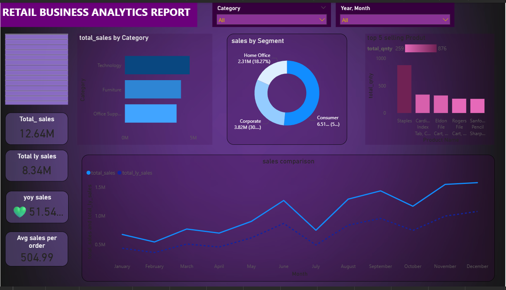
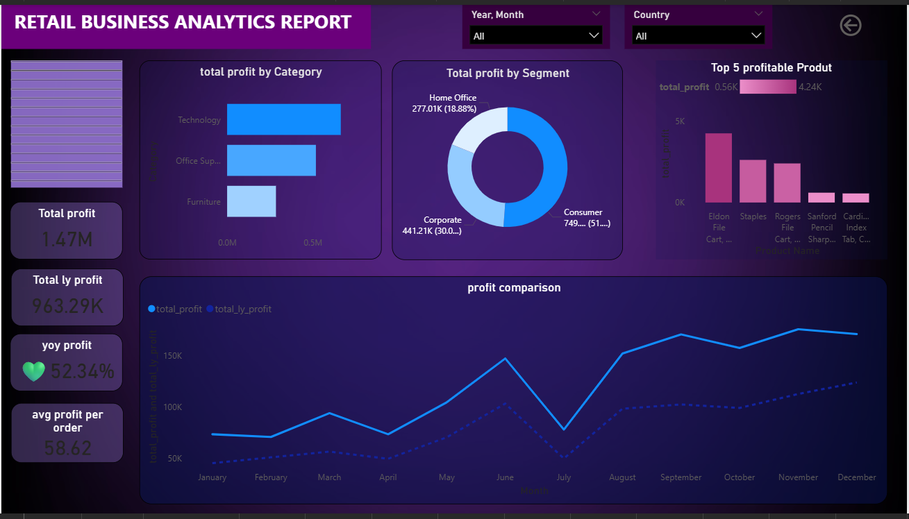
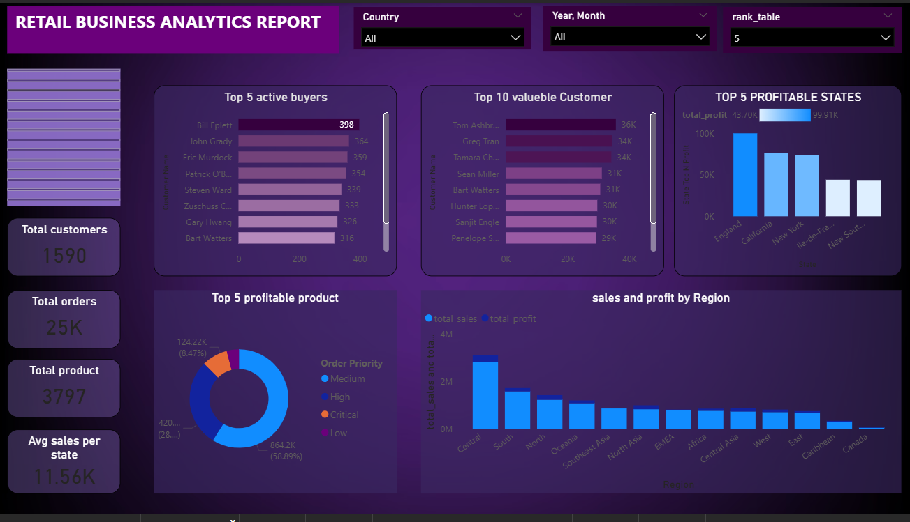

# 🛒 Retail Business Analysis Dashboard - End-to-End Data Analysis Project
This project focuses on building an interactive Retail Dashboard using Power BI.
It involves the complete data analysis lifecycle — from data cleaning and
transformation to exploratory data analysis (EDA) and visualization.

## 📌 Project Workflow
Raw Data ➡️ Data Cleaning & Preparation ➡️ Data Modeling ➡️ DAX Measures ➡️ Power BI Dashboard

## 📊 Dataset Information
- Number of Sheets: 7 (product_data, location_data, customer_data, sales_data, Orders, Returns, People)
- Total Orders: 51,290 rows
- Total Columns (Orders sheet): 23 columns
- Stored in: Excel

### Key Tables
| Sheet | Rows | Columns | Description |
|-------|------|---------|-------------|
| sales_data | 51,290 | 13 | Core sales transactions |
| product_data | 3,797 | 4 | Product details & categories |
| location_data | 3,812 | 6 | City, State, Country, Region |
| customer_data | 1,590 | 3 | Customer segments |
| Orders | 51,290 | 23 | Full combined orders data |
| Returns | 1,173 | 3 | Returned orders |
| People | 13 | 2 | Regional people data |

## 🔧 Steps Involved

### 1. Data Cleaning & Preparation
- Removed duplicates and handled missing values
- Standardized date formats for time intelligence functions
- Cleaned and standardized Region, Market, and Segment data
- Handled discount and shipping cost inconsistencies

### 2. Data Modeling
- Built relationships between sales_data, product_data, location_data and customer_data
- Created a proper Date table for time intelligence functions
- Designed star schema for optimized DAX performance

### 3. DAX Measures
- Built dynamic KPI measures using time intelligence:
  - `Total Sales = SUM(sales_data[Sales])`
  - `PY Sales = CALCULATE([Total Sales], SAMEPERIODLASTYEAR(Date[Date]))`
  - `YoY Growth % = DIVIDE([Total Sales] - [PY Sales], [PY Sales])`
- Category-wise contribution % using `ALL()`
- Average Profit per Order using `DIVIDE()`
- Total Profit & YoY Profit Growth

### 4. Key Insights from EDA
- 51% YoY Sales Growth identified — strong business momentum
- Top revenue-driving categories: Technology, Furniture, Office Supplies
- High-value customer segments (Consumer, Corporate, Home Office) uncovered
- Region-wise and Market-wise performance gaps identified
- Seasonality and monthly trends revealed for better forecasting

## 📈 Dashboard Pages (Power BI)
1. Sales Analysis
2. Profit Analysis
3. Demographics

## 🚀 Tools & Technologies
- Visualization: Power BI
- Languages: DAX
- Data Source: Excel (7 sheets)

## 🧠 Learnings
- Advanced DAX time intelligence functions
- Power BI data modeling with multiple related tables
- Star schema design for performance optimization
- Deriving business insights from large retail datasets
- Building executive-level interactive multi-page dashboards

## ✅ Page 1: Sales Analysis
YoY Sales Growth, monthly trends, top revenue-driving categories
and region-wise performance benchmarking across global markets.

## ✅ Page 2: Profit Analysis
Profitability metrics including Total Profit, YoY Profit Growth
and Average Profit per Order for product and segment efficiency insights.

## ✅ Page 3: Demographics
High-value customer segments (Consumer, Corporate, Home Office),
regional breakdown and customer contribution to total revenue.

---

## 📊 Dashboard Screenshots

### Page 1 – Sales Analysis

### Page 2 – Profit Analysis

### Page 3 – Demographics

---

## 📁 Dataset
- Source: Global Retail Sales Data
- File: `dataset/global_retail_sales_data.xlsx`
- Sheets: product_data | location_data | customer_data | sales_data | Orders | Returns | People
